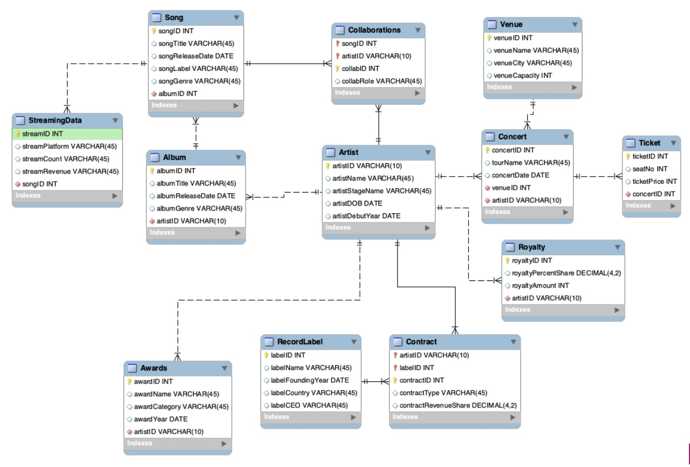

# Team 4 MIST 4610 Group Project 1

## TEAM NAME: 
21482 Group 4 

# Team Members
- Jennifer Lee [@jcnniferlee](https://github.com/jcnniferlee/MIST4610GroupProject1.git)
- Connie Wang 
- Kevin Choi 
- Kayla Valentine
- Vivek Shah

# Scenario Description
The scenario at hand is to design and implement a relational database that enables a large music conglomerate to efficiently manage its multiple record labels. The primary entity in the system is the Record Label, as each label operates under the conglomerate by signing artists, managing music releases, overseeing concerts, and handling various revenue streams such as ticketing and royalties. Each record label functions as an independent entity within the conglomerate and these labels work hand in hand with streaming platforms, concert venues, and distribution networks to promote artsts and maximize revenue. By establishing a well structured database, the system allows stakeholders to track artist success, label performance, and financial efficiency in real-time. Our focus is to accurately represent these relationships within the database and populate the system with sample data, allowing us to perform functional queries that may provide us with valuable business insight about the conglomerate. 

# Data Model

# Data Dictionary

# Queries

# Database Info

